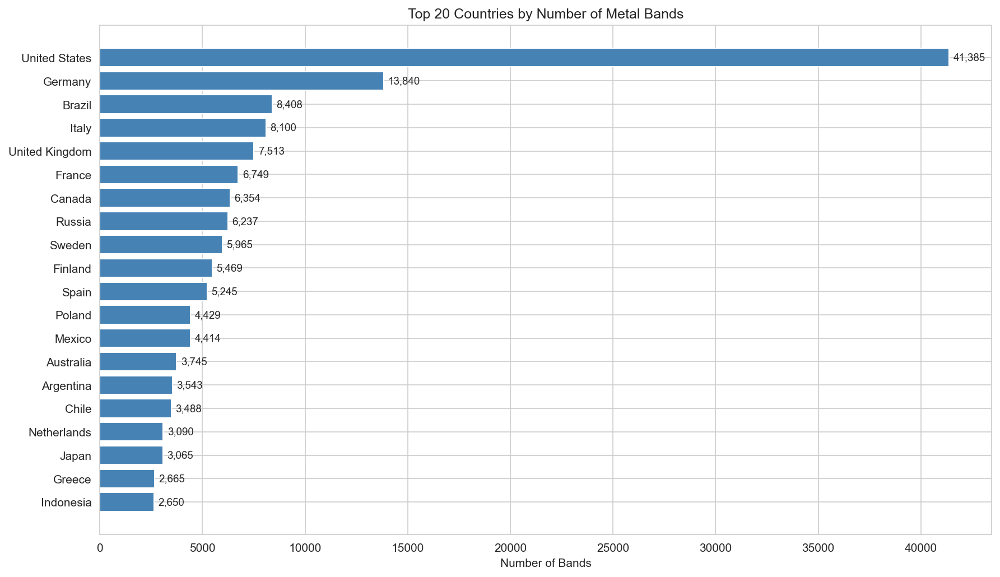
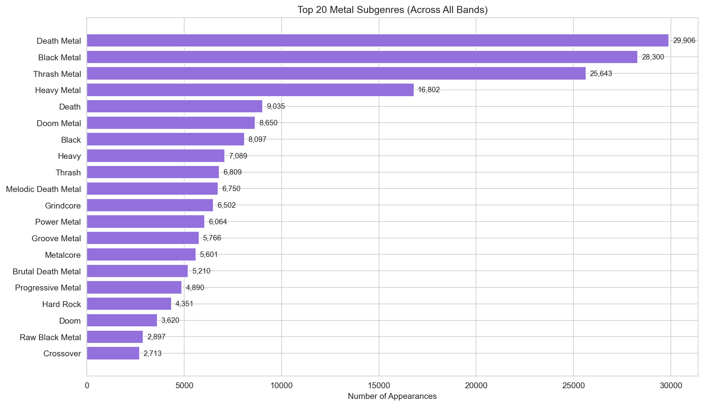
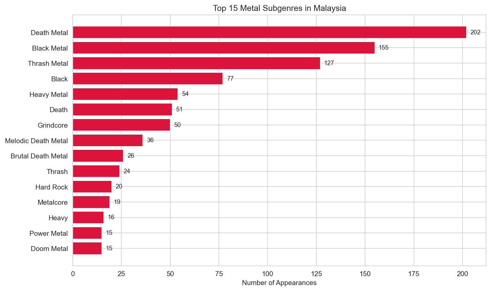
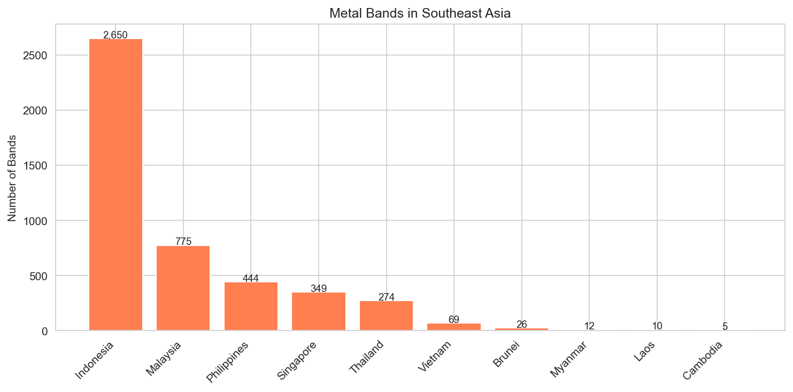
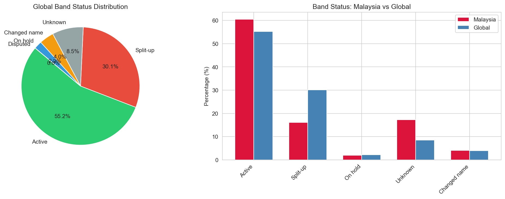

# Global Metal: Exploratory Data Analysis of 160,000+ Metal Bands

An exploratory data analysis of the Encyclopaedia Metallum (Metal Archives) 
dataset, examining global trends in heavy metal music across countries, 
subgenres, and decades.

## Questions Explored
- Which countries produce the most metal bands, both total and per capita?
- How have subgenres evolved across the global metal scene?
- What does Southeast Asia's (and Malaysia's) metal scene look like?
- How do band survival rates differ between Malaysia and the global average?

## Dataset
- **Source:** [Encyclopaedia Metallum via Kaggle](https://www.kaggle.com/datasets/guimacrlh/every-metal-archives-band-october-2024)
- **Records:** 183,394 bands across 157 countries
- **Features:** Band name, country, genre, status

## Tools
Python, pandas, NumPy, matplotlib, seaborn, Jupyter Notebook

## Key Findings

### Global Distribution
- The United States leads with 41,385 bands, followed by Germany (13,840) and Brazil (8,408).
- Nordic countries punch far above their weight — Finland has 5,469 bands for a population of just 5.5 million.



### Genre Landscape
- Death Metal (29,906) and Black Metal (28,300) dominate globally, followed by Thrash Metal (25,643).
- Malaysia mirrors this trend with Death Metal (202) and Black Metal (155) leading, but Thrash Metal (127) holds a proportionally stronger presence.




### Southeast Asia
- Indonesia dominates the region with 2,650 bands — more than triple Malaysia's 775.
- Singapore (349) stands out relative to its small population.



### Band Status
- 55.2% of bands globally are active, while 30.1% have split up.
- Malaysian bands have a higher active rate (~60%) compared to the global average, suggesting a younger, growing scene.
- Malaysia also shows a higher "Unknown" rate (17% vs 8.5%), likely reflecting underground bands that are harder to track.



## Project Structure
```
metal-eda/
├── data/              # Dataset (not tracked in git)
├── notebooks/         # Jupyter notebook with full analysis
│   └── 01_eda.ipynb
├── outputs/           # Generated charts
├── src/               # Scripts (future use)
├── .gitignore
├── README.md
└── requirements.txt
```

## How to Run
1. Clone the repository: `git clone https://github.com/YOUR_USERNAME/metal-eda.git`
2. Create a virtual environment: `python -m venv venv`
3. Install dependencies: `pip install -r requirements.txt`
4. Download the dataset from [Kaggle](https://www.kaggle.com/datasets/guimacrlh/every-metal-archives-band-october-2024) and place CSV files in `data/`
5. Open `notebooks/01_eda.ipynb` in Jupyter Notebook